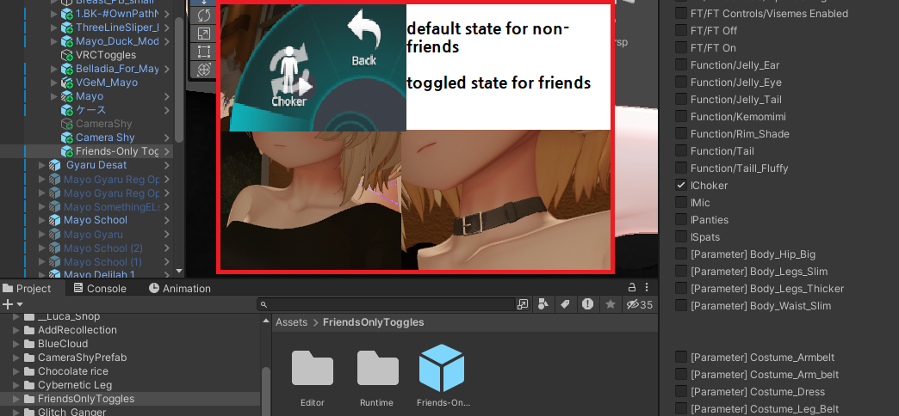

# VRC Friends-Only Toggles

Turn MA/VRCFury/regular avatar controls into friends-only space. Toggles stay inactive for strangers, while float/radial/axis controls stay at their configured default. Any changes remain visible to you and friends.

## Use

1. Double click `FriendsOnlyToggles.unitypackage`, or add the VPM repository to VCC and install **VRC Friends-Only Toggles**.
2. Drag **Friends-Only Toggles** prefab anywhere under the avatar.
3. **Scan Post-Build Menu**
4. Check the toggles, radial controls, or axis controls to protect, then upload normally.

Non-destructive and reversed by removing the gameobject.
